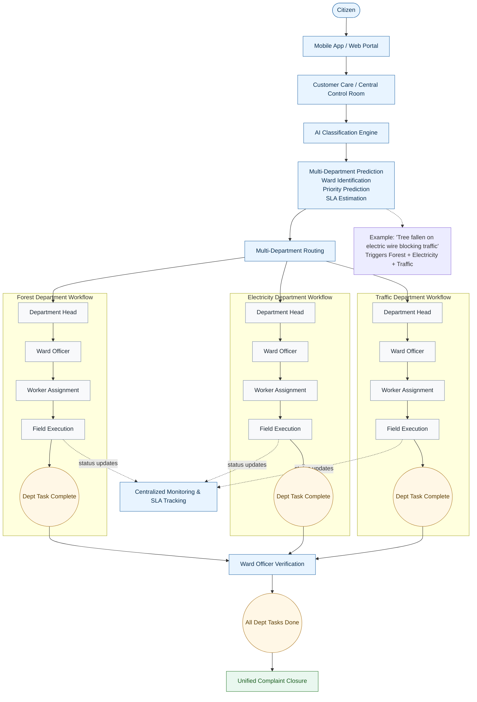

# Smart City Civic Complaint Workflow (Multi-Department)

```mermaid
flowchart TB
  %% Nodes
  citizen([Citizen])
  portal["Mobile App / Web Portal"]
  care["Customer Care / Central Control Room"]
  ai["AI Classification Engine"]
  aiTasks["Multi-Department Prediction\nWard Identification\nPriority Prediction\nSLA Estimation"]
  routing["Multi-Department Routing"]

  %% Department parallel lanes
  subgraph deptA["Forest Department Workflow"]
    forestHead["Department Head"]
    forestWard["Ward Officer"]
    forestWorker["Worker Assignment"]
    forestField["Field Execution"]
    forestDone(("Dept Task Complete"))
  end

  subgraph deptB["Electricity Department Workflow"]
    elecHead["Department Head"]
    elecWard["Ward Officer"]
    elecWorker["Worker Assignment"]
    elecField["Field Execution"]
    elecDone(("Dept Task Complete"))
  end

  subgraph deptC["Traffic Department Workflow"]
    trafficHead["Department Head"]
    trafficWard["Ward Officer"]
    trafficWorker["Worker Assignment"]
    trafficField["Field Execution"]
    trafficDone(("Dept Task Complete"))
  end

  monitor["Centralized Monitoring & SLA Tracking"]
  verify["Ward Officer Verification"]
  sync(("All Dept Tasks Done"))
  close["Unified Complaint Closure"]

  %% Main flow
  citizen --> portal --> care --> ai --> aiTasks --> routing

  %% Parallel department routing
  routing --> forestHead
  routing --> elecHead
  routing --> trafficHead

  %% Forest workflow
  forestHead --> forestWard --> forestWorker --> forestField --> forestDone

  %% Electricity workflow
  elecHead --> elecWard --> elecWorker --> elecField --> elecDone

  %% Traffic workflow
  trafficHead --> trafficWard --> trafficWorker --> trafficField --> trafficDone

  %% Monitoring and verification
  forestField -. status updates .-> monitor
  elecField -. status updates .-> monitor
  trafficField -. status updates .-> monitor

  forestDone --> verify
  elecDone --> verify
  trafficDone --> verify

  verify --> sync --> close

  %% Example annotation
  example["Example: 'Tree fallen on electric wire blocking traffic'\nTriggers Forest + Electricity + Traffic"]
  aiTasks -.-> example

  %% Styling
  classDef core fill:#e8f4ff,stroke:#2f6fab,stroke-width:1px,color:#0a2d4d;
  classDef dept fill:#f8f9fb,stroke:#7a8aa1,stroke-width:1px,color:#1c2833;
  classDef milestone fill:#fff7e6,stroke:#b07d2b,stroke-width:1px,color:#5a3b00;
  classDef endstate fill:#e9f7ef,stroke:#2e7d32,stroke-width:1px,color:#1b5e20;

  class citizen,portal,care,ai,aiTasks,routing,monitor,verify core;
  class forestHead,forestWard,forestWorker,forestField,elecHead,elecWard,elecWorker,elecField,trafficHead,trafficWard,trafficWorker,trafficField dept;
  class forestDone,elecDone,trafficDone,sync milestone;
  class close endstate;
```

